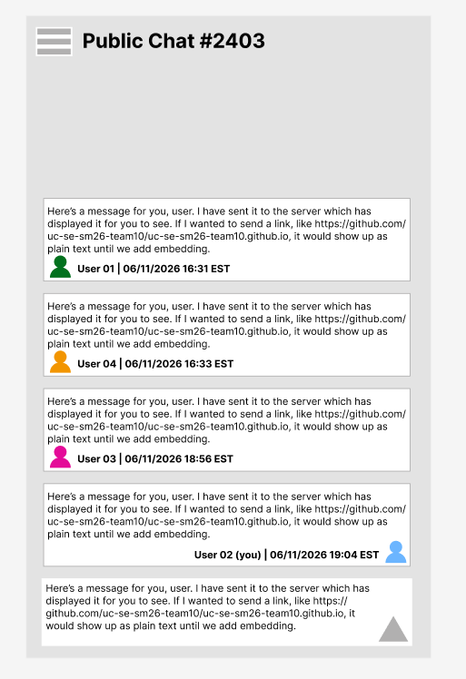
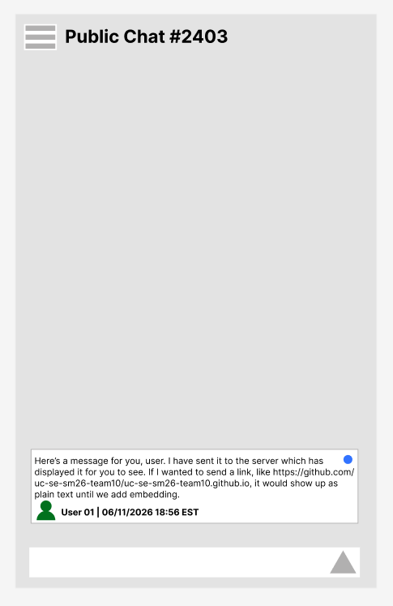

# README.md — Scrum Project Report Template

> \_\*\*Note:\*\* This is a starter template for your team to begin Sprint 0.\_
> \_It is the \*\*minimum\*\* required structure for your final report and is expected to grow across sprints.\_
> \_Your team may add sections; please discuss any \*\*removal\*\* of a section with the instructor (open a pull request).\_

**University of Cincinnati**

**EECE/CS-3093C — Software Engineering, Summer 2026**

**Instructor:** Dr. Phu Phung

\---

# Scrum Project — Messenger

Messenger is a real-time web-based chat application that allows registered users to communicate through public, private, and group messaging with additional features.

## Team Members

*Teams are 3–4 students (per syllabus). Solo teams are not permitted.*

1. Joe Wilkie — wilkiejj@mail.uc.edu — Product Owner
2. Khoi Tran — tran2ki@mail.uc.edu — Scrum Master
3. Skylar Bleau — bleausr@mail.uc.edu — Repository Owner
4. Noah Batcher — batchenh@mail.uc.edu

\---

# Project Management Information

|Item|URL|
|-|-|
|Team homepage / landing page|https://uc-se-sm26-team10.github.io|
|Live prototype (Azure App Services)|https://TODO.azurewebsites.net|
|GitHub Projects board (private)|https://github.com/orgs/uc-se-sm26-team10/projects/1|
|Source code repository (private)|https://github.com/uc-se-sm26-team10/uc-se-sm26-team10.github.io|
|MongoDB Atlas cluster (configuration only — no credentials)|*e.g., cluster name, region*|

## Revision History

|Date|Version|Description|Author|
|-|-|-|-|
|05/28/2026|0.1|Initial Setup and Draft (Sprint 0)||
|05/28/2026|0.1|Added own personal info (Sprint 0)|Khoi Tran|
|06/04/2026|0.2|Added use cases and architecture (Spring 0)||

\---

# Overview

*Start in Sprint 0; refine across all sprints.*
For far too long, we have been complacent with the lack-luster levels of communication offered by the current messaging platforms. The interfaces are often too complex and provide minimal details, and quality customization and optimization of these apps is very rare. That's what we are working to change.

-# Describe the project in 2–4 paragraphs: the problem it addresses, the target users, and a high-level summary of the proposed solution. Include a **high-level architecture diagram**

\---

# System Analysis

*Start in Sprint 0; keep updating.*

## User Requirements

List the high-level functional and non-functional requirements. These will be refined into user stories and use cases. *(Main focus of Sprint 0.)*

* **FR-1:** Send Messages — *As a user, I want to send messages to other users with instant sending so that communication is seemless.*
* **FR-2:** Recieve Messages -  *As a user, I want to recieve messages from other users with instant recieving so that communication is seemless.*
* **NFR-1 (Performance):** Low RAM/CPU/GPU usage - *As a user, I want a lightweight application so that my system isnt stressed*
* **NFR-2 (Usability):** User Interface - *As a user, I want a clear login and chat interface so that navigation is easy*
* **NFR-3 (Security — see §Security):** Scan Files - *As a user, I want to be protected from bad actors so that I can safely message*

## User Stories \& Product Backlog

* [Scrum Teamp Planning Backlog](https://github.com/orgs/uc-se-sm26-team10/projects/1)  


## Use Cases

Include the **use-case diagram** and a **brief description** (1–3 sentences) for each use case. *(Main focus of Sprint 0.)*

### Diagram
* High Level Use Case Diagram    
[](https://editor.plantuml.com/uml/NP313e8m38RlUufcTmu2PuCXyQGN2G-mZ3gNp8sqnSGOtzr1E837lz_NDct3OaYcPr01xmAIWBnx20oUq8fFKHahYK2tASPSmG5wHj9W61QYPiz45n3q5PanEYGuZQE6ZmAO6AtXp3gC0yo2SRXqz-rXoszeqR_mJoctoiMpm9bydiGhhtOyEH-XGpiHXlTgrEgxdb0KnsNfDfMxLErIhPgyAR_c1m00)    

* Use Case 1: Send Message  
[](https://editor.plantuml.com/uml/NP4_JmCn3CNta-uxM9r0D42XB0oeA69aEjq432OnLTHS4YK-f7vxV7yHB9PYl_VpIt8eZ9dxpaDRI6cKShjJ3GMhNgaKF59TeU6OOQDZ26IOx23D6y02RLqbiJlZ4WOMYNSKU1pfVwE6ylViQkgg1VK46Xw1pucWcpR15HZlp0c6zN03AKiVNW9JXhTdBS6kTnyInpDGb_Yy-kRXdGpr0dR743E10XiXH8OYpBeYNqYEGVq1pBP6R8DiQLzOPBnSwFT2RnQPZ_44VHhbagwN1mdOhKdsatQEyfaZMeE5L_1asuxyzy0HqFlXxl9uPTst_MNfaTKAotZ232wadk7BaRUB_45aunKFKkK_Vm00)    

* Use Case 2: Receive Message  
[](https://editor.plantuml.com/uml/fP4nJmCn38Nt_8gdJZ0SQWiJ0sgLcUbq4xh1JIo8b4jEiLk9Vu_RSb1c5Wz-xtssPRSJfQR7AMCGxZnPMM-wdaliNbc4tjdDPaWXpLGKgvxRYTiA9EZ_AZudBdfHlAEWjLclbi91EPxfrzJWUdGly7Z6eLMAWKJ19ulUHLAwXrPGpWW_qN012zxslbjl7pQZewm87wIOhYjUyyulO8eHcanKckObjntF1dCCveX9vaoVI0MDPQv5M42DwMOAPs4OGe_ohm7VY5lwu_ZBaj2gtMjd7wfgdHRFasrGejjPiVUuBm00)    

* Use Case 3: Maintain List of Users/Friends  
[](https://editor.plantuml.com/uml/ZL9DJuD04BsJy1yclNWfKUBDWwcXCHwgJKhu0PjbscwwtSMTGV--iq2n0QEIm8Pzyzwy-LWHgy3jsK95c1LAFdVtsQioZkNDDeOus-up0GFTFWU3hgOqIHEbsGTO5Duvr8nrf8S5A89g1BTyn705v6dII3AZJQCS2zcA77TOCO5A31y3hOpfAiWUeO07ACK0z3vWX-yj4gT94T4oef8NPx3Gymj_umy4Kfo75t_6HXtmYZumQ50WYEKlXxyRiSAAMrg2cdcGdfIN53laDhX_YIXhvqBVPgL1-aJWtIG8tZoRlT6AZNU3_ogNye_-atuMbQ5O7lbhT4PcbYOWpzZRxdRMlHWoTcYD5daUWvPm57_I6XjPYObwV_sxV3-_RjdYwCTzYq7bNnvS7SjSoIdh_0K0)  

* Use Case 4: Login Securely  
[](https://editor.plantuml.com/uml/JP0n3i8m34NtdEAhErT0bH0R6-e1hCIq4Qc371S6nDr9KWOMIzz-tz_oM8pKjZMvn3U3PMYS5qE8ojvY5aVUic8uPP7QuO2fi0wWWiarXcHEZ2lhanLl1so5FHN6S1QhhIfLQ6MG13oeb5VMqFtSvl-6qyB-ZfJdAF3AeGAHKkcmRxD_-DAnUZ1vdpUnJdMl-xW9XyFn5z0hgjnNzDhapkvfLKvkP0dj4ry0)   

### Brief Description

| UC ID | Use Case | Primary Actor | Brief Description |
| :--- | :--- | :--- | :--- |
| UC-01 | Send Message    | Connected User | Actor types a message and clicks Send; system receives the message and delivers it in real time to all connected users in global chat or private chat.  |
| UC-02 | Receive Message | Connected User | System notifies user of incoming message and displays it in the conversation view without page refresh. They will also receive in real time without refreshing the number of active users and user status (typing, active, offline) |
| UC-03 | List Friends    | Connected User | Users can follow/add users/friends and view them in a list. They can also make a  private group chats and see users/friends status. |
| UC-04 | Login Securely     | Connected User | Users are the only ones able to access their accounts and can do so with their unique username across multiple devices. |

\---
### Acceptance Criteria
- AC-01.1: a message input field and a Send button are present and usable on the chat screen.
- AC-01.2: when the input field is empty and Send is clicked or Enter is pressed, no message appears
in the chat.
- AC-01.3: when a non-empty message is sent, it appears in the chat window of all connected users
immediately.
- AC-01.4: each message displayed in the chat shows the sender's username alongside the message
text.
- AC-01.5: after a message is sent, the input field is cleared and ready for the next message.
- AC-02.1: incoming chat messages are displayed in the responses area without page refresh.
- AC-02.2: each message shows a timestamp alongside the message text.
- AC-02.3: system status events (join/leave) are displayed in the status area, visually separate from
chat messages.
- AC-02.4: the status area auto-scrolls to the latest system event.
- AC-03.1: User can view list of friends and choose to message them
- AC-03.2: User can see whether a friends is offline or online
- AC-03.3: User can request to be friends with other users
- AC-03.4: User can see request to be friends from other users they are not friends with
- AC-03.5: User can accept or decline friend request sent to them
- AC-04.1: No letters of the password are visible while typing when logging in
- AC-04.2: Alerts users when password is incorrect
- AC-04.3: Other users can't send/receive messages on an account they aren't logged in to
- AC-04.4: Users can't inject scripts into username/password field

# System Design


## Architecture

The system architecture will not differ from the high-level overview diagram. The user will interact with the server through their client-side browser. The clients browser will utilize the web code stack (HTML, CSS, and JavaScript) to interact with the server, which will use node.js to host, HTTP(normal requests), and socket.io(real time communication) for real time interactions between users. The server will store data using MongoDB Atlas, this will include usernames, passwords, user status, friend requests, and friends lists. The user status will show if they are online, offline, or currently typing. 


## Use-Case Realization

For each use case in §Use Cases, describe how it is realized in code: which modules, endpoints, and database collections participate. **Sequence diagrams** are encouraged for non-trivial flows (e.g., authentication, message send/receive). *(Sprint 1 onward.)*

## User Interface

### UI Mockup: Use-Case-01
This Mockup is of the UI after sending a message. Interactable elements are purposely limited in this iteration. The white bar across the bottom can be clicked into for message typing, the grey triangle within that bar sends the message when clicked, and the three lines in the top corner can be clicked to see users currently online, as well as to access your friend list and other chats. The sent message is distinct from others due to the mirrored user icon.



### UI Mockup: Use-Case-02
This Mockup is of the UI after receiving a message. Interactable elements are the same as above, with the typing bar, sending triangle, and three line menu. The received message has a blue dot in the corner, indicating it hasn't been viewed yet.



## Database

Describe your **MongoDB Atlas** schema: collections, fields, indexes, and relationships. Include a sample document for each collection. *(Sprint 2 onward; refine in Sprint 3.)*

```json
// Example collection: users
{
  "\_id": "ObjectId",
  "username": "string (unique, indexed)",
  "passwordHash": "string (bcrypt)",
  "createdAt": "ISODate"
}
```

\---

# Security (SSDLC)

*Start in Sprint 0; **mandatory** updates at the Sprint 1–2 SSDLC checkpoint and again in Sprint 3.*

This section documents how your team applies the **Secure Software Development Lifecycle** across every phase. Do **not** treat security as an afterthought — it is graded across all sprints.

## Security Requirements

List security requirements alongside functional requirements. *(Sprint 0.)*

* **SR-1:** Malware Protection - All files introduced by the team will be scanned for malware [MalwareBytes, VirusTotal]. In an ideal situation, we would do a baseline system file hash and then re-hash every month to check for tampering.
* **SR-2:** Password Protection — *All passwords and sensitive information will be salted and then hashed for protection. SHA256 or higher, not MD5 hash.*
* **SR-3:** XSS Injection Protection - *All text entered by the user will be 'cleansed' before being sent [for example, '</' will be turned into '<' to mess-up the script tag], primarily for login.*

## Threat Model

Identify assets, trust boundaries, and threats. STRIDE or attack-tree format is acceptable. *(Sprint 0–1.)*

|Asset|Threat|Mitigation|
|-|-|-|
|Project passwords|Threat actor could view source code and steal passwords|all passwords will be stored on a .gitignore file and will only be accessable on the backend|
|User credentials as a whole|Credential stuffing and/or script injection|Rate limiting + text cleansing + salting then hashing sensitive info|
|Users own credentials as a single person|Password being stolen|2FA using TOTP|

## Security Review Notes

Summarize findings from your Sprint 2 security review and any remediation taken. *(Sprint 2 onward.)*
-[] TODO
\---

# Implementation

*Start in Sprint 1; keep updating.*

Specify your development approach, languages, frameworks, and runtime. Default stack for this course:

|Layer|Technology|
|-|-|
|Runtime|Node.js (Azure Cloud Shell for development)|
|Server framework|TODO *(e.g., Express)*|
|Database|MongoDB Atlas|
|Client|HTML / CSS / JavaScript *(framework optional)*|
|Version control|git + GitHub (branches + pull requests + code review)|
|Project mgmt|GitHub Projects|
|Hosting|Azure App Services|
|CI/CD|GitHub Actions|
|...|...|

For each sprint, add a subsection that summarizes new implementation work. Include code snippets only when they illustrate a non-trivial design decision (not as a substitute for the source code itself).

## Getting Started Locally

```bash
# Clone
git clone git@github.com:TODO/TODO.git
cd TODO

# Install dependencies
npm install

# Configure environment (copy and edit; never commit .env)
cp .env.example .env

# Run
npm start
```

## CI/CD Pipeline

Describe the GitHub Actions workflow(s) under `.github/workflows/`. *(Sprint 1 onward.)*

* **Build \& test:** triggered on every push and pull request.
* **Deploy:** triggered on merge to `main`; deploys to Azure App Services.

## Deployment

Describe how to deploy and the URL of the live application. Include a note on environment variables (set in Azure App Services Configuration, never in source). *(Sprint 1 onward.)*

\---

# Testing \& Quality Assurance

*Start in Sprint 1; **major** focus in Sprint 3.*

## Test Plan

Summarize your testing strategy across unit, integration, and system testing. *(Sprint 2 onward.)*

## Test Coverage

Report current test coverage and how to run the suite locally and in CI.

```bash
npm test
```

## QA Plan

Manual test cases for user-facing flows, with expected vs. actual results. *(Sprint 3.)*

\---

# GenAI Usage \& Reflection

*Start in Sprint 2; **required** in Sprint 3.*

Per the course academic integrity policy, the team must document all AI-assisted work on the team project. **Sprint 3 recommends the team to use a GenAI tool** for the final prototype and to document each substantive prompt.

\---

# Software Process Management

*Start in Sprint 0; keep updating.*

Describe how your team applies **Scrum**: roles, ceremonies (sprint planning, daily stand-ups, review, retrospective), and tools (GitHub Projects board, GitHub Issues, pull requests).

Our team plans to meet weekly at the class's Lab, Thursday 6-9:00 PM for the project and related discussion, including Scrum. Outside of that timeframe, plannings, discussions, and more will be held via the groups' Discord server.
Tools we will use for Scrum will be GitHub Projects, Issues, pull requests.
Items can be self-created and assigned to designated members via discussion. Items stay in the drafting stage while in-progress. If the item warrants further discussion, it will be held while turning the draft into an issue. An issue is closed when the the item is finished up to standards.

Include:

* A screenshot of the **GitHub Projects board** (Todo / In Progress / Done) at the end of each sprint.
* A **Roadmap view** screenshot from GitHub Projects, or a timeline produced from issue milestones. *(Note: GitHub Projects has a Roadmap view rather than a true Gantt chart; a Roadmap screenshot satisfies this requirement.)*

## Scrum Process

> Copy the block below for each sprint (Sprint 0, 1, 2, 3).

### Sprint 0

**Duration:** 2026-05-25 to 2026-06-14

#### Sprint Goal

Establish the general objectives for the project, establish use cases to address, and design the system architecture.

#### Completed PBIs / Tasks

1. Set up team organization and repositories
2. Created detailed and achieavable PBI list of Use Cases, Scenarios, and Personas
3. Outlined the future immediate actions needed to keep sensitive information secure
4. Documented project in README.md
5. Created design mockups

#### Contributions

|Member|Hours|Contribution Summary|
|-|-|-|
|Joe Wilkie|9|UI Diagrams, Use-Case Diagrams, Administrative Changes|
|Khoi Tran|9|Overall help, managing project board|
|Skylar Bleau|9|Created organization, helped create PBIs, created html mockup barebones for login and chat UI|
|Noah Batcher|9|Participated in all use case setup, System design architecture diagram, helped with general project board setup |

#### Sprint Retrospective

|Good|Could have been better|How to improve|
|-|-|-|
|Assigned work fully completed|Submitting earlier for extra credit|Being more punctual with work and submitting earlier|
|Feature list amount|Feature list nuance/depth|For each feature, give criteria/description to understand what is expected|
|Division of labor|Tracking of individual tasks|Use PBI board to maintain list of responsibilities per person|

### Sprint 1

**Duration:** 2026-06-15 to 2026-06-28

#### Sprint Goal

TODO — one sentence.

#### Completed PBIs / Tasks

1. TODO
2. TODO
3. TODO

#### Contributions

|Member|Hours|Contribution Summary|
|-|-|-|
|Member 1|X|TODO|
|Member 2|X|TODO|
|Member 3|X|TODO|
|Member 4|X|TODO|
|Member 5|X|TODO|

#### Sprint Retrospective

|Good|Could have been better|How to improve|
|-|-|-|
||||
||||
### Sprint 2

**Duration:** 2026-06-29 to 2026-07-12

#### Sprint Goal

TODO — one sentence.

#### Completed PBIs / Tasks

1. TODO
2. TODO
3. TODO

#### Contributions

|Member|Hours|Contribution Summary|
|-|-|-|
|Member 1|X|TODO|
|Member 2|X|TODO|
|Member 3|X|TODO|
|Member 4|X|TODO|
|Member 5|X|TODO|

#### Sprint Retrospective

|Good|Could have been better|How to improve|
|-|-|-|
||||
||||
### Sprint 3

**Duration:** 2026-07-13 to 2026-07-26

#### Sprint Goal

TODO — one sentence.

#### Completed PBIs / Tasks

1. TODO
2. TODO
3. TODO

#### Contributions

|Member|Hours|Contribution Summary|
|-|-|-|
|Member 1|X|TODO|
|Member 2|X|TODO|
|Member 3|X|TODO|
|Member 4|X|TODO|
|Member 5|X|TODO|

#### Sprint Retrospective

|Good|Could have been better|How to improve|
|-|-|-|
||||
||||

Working through the sprints is a continuous-improvement process. The retrospective happens at the end of a sprint, before planning the next one. Cover three things briefly:

* **What went well** — celebrate and reinforce.
* **What could have been better** — be specific (e.g., "we underestimated authentication" not "things were hard").
* **How we will improve next sprint** — concrete, owned actions.

Keep it under an hour. The output is bullet points in the table above and any new PBIs created on the board.

\---

# User Guide / Demo

*Start in Sprint 1; finalize in Sprint 3.*

Write this section as both a **demo** (with screenshots of the running application) and a **how-to** for a first-time user. Cover sign-up, login, and the main user flows.

\---

# License \& Code of Conduct

This project is developed for academic purposes as part of EECE/CS-3093C at the University of Cincinnati. The team follows the **ACM/IEEE Software Engineering Code of Ethics** (https://www.acm.org/code-of-ethics).

If your team chooses to publish the repository after the course, add an explicit license (e.g., MIT) here and a `LICENSE` file at the repo root.

\---

*End of template. Last template revision: 2026-05-29.*

